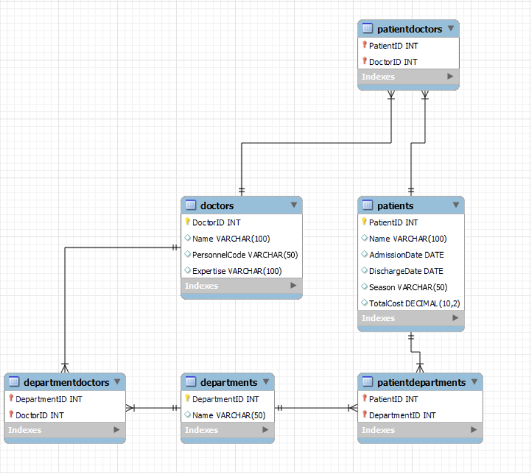

# Hospital Database

This repository contains a complete MySQL database schema for a hospital management system, including tables, relationships, and sample views.

## 📁 Database Structure

The main file [`hospitaldatabase.sql`](hospitaldatabase.sql) includes:
- `CREATE DATABASE` and `USE`
- All tables: `departments`, `doctors`, `patients`, `patientdepartments`, `patientdoctors`, `departmentdoctors`
- Sample data (40 patients, 20 doctors, etc.)
- All views (see `views/` folder)

## 🧩 Views

The following views are available in the [`views/`](views/) folder:

| View Name | Description |
|-----------|-------------|
| `doctorservices` | Doctors with their department names |
| `doctorsvisitedadmittedpatients` | Doctors who visited specific admitted patients |
| `patientinpatientcost` | Inpatient cost for a specific patient |
| `patientsdischargedwithin10days` | Patients discharged within 10 days of admission |
| `patientsininpatient` | Patients assigned to inpatient department |
| `seasonsurgeriesbydoctor` | Surgeries performed by a specific doctor in Spring |

## 📊 Entity Relationship Diagram

